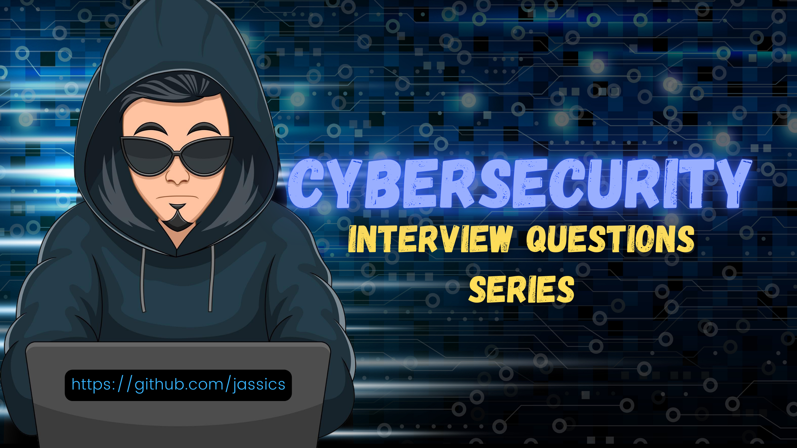

# Cybersecurity Interview Questions Collections
**Security interview questions for different security skills with possible explanations.**

This GitHub repo is for security professionals who want to prepare for various security roles with different skill sets, such as AppSec, DevSecOps, cloud security, etc.

_Feel free to contribute to different security interview pages based on your interview experience._
I am adding interview questions based on my experience and different network conversations on the same topic(s).

## ToC
1. [Common Security Interview Questions](common-security-interview-questions.md)
2. [Web Security/ Penetration testing Interview Quesitons](web-security-interview-questions.md)
3. [Application Security Interview Questions](application-security-interview-questions.md)
4. [API Security Interview Questions](api-security-interview-questions.md)
5. [Network Security Interview Questions](network-security-interview-questions.md)
6. [AWS Security Interview Questions](aws-security-interview-questions.md)
7. [GCP Security Interview Questions](gcp-security-interview-questions.md)
8. [DevSecOps Interview Questions](devsecops-interview-questions.md)
9. [Container Interview Questions](container-security-interview-questions.md)
10. [SOC Interview Questions](soc-interview-questions.md)
11. [GRC Interview Questions](grc-interview-questions.md)
