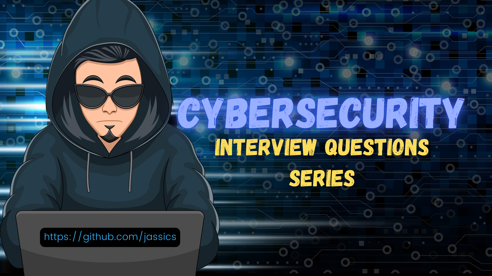

# Cybersecurity Interview Questions Collections
**Security interview questions for different security skills with possible explanations.**

This GitHub repo is for security professionals who want to prepare for various security roles with different skill sets, such as AppSec, DevSecOps, cloud security, etc.

_Feel free to contribute to different security interview pages based on your interview experience._
I am adding interview questions based on my experience and different network conversations on the same topic(s).

## Which file should I use? (AppSec / API / Web / Security Architect)

Four files in this repo — Application Security, API Security, Web Security, and the Security Architect scenarios — cover closely related ground by design, so they're split by **role and altitude** rather than by topic alone, and they cross-link to each other instead of duplicating content. Use this table to pick the right starting point for the role you're preparing for or hiring against:

| File | Target role | Altitude / focus | Format |
|---|---|---|---|
| **[Application Security](application-security-interview-questions.md)** | AppSec Engineer (junior → senior/staff), developer-facing security | SDLC-centric: secure code review, secure coding, threat modeling, SDL process, cryptography basics — "how do you get engineering to build secure software" | Question lists with guidance on what to listen for, plus a secure-code-review round with vulnerable code snippets |
| **[API Security](api-security-interview-questions.md)** | API Security Engineer, AppSec-with-API-focus | OWASP API Security Top 10, JWT/OAuth2/mTLS, GraphQL & gRPC authorization, API gateway architecture — the "machine-to-machine interface" specialization | Conceptual Q&A + 8 scenario-based questions with vulnerable/fixed code and diagrams |
| **[Web Security / Pentest](web-security-interview-questions.md)** | Web App Penetration Tester, Web Security Engineer | Offensive/exploit mechanics: browser security model (SOP/CORS/CSP), OWASP Top 10 exploit internals, session/auth attacks, pentest methodology & tooling | Conceptual Q&A + 6 scenario-based questions with PoC-style walkthroughs and fixes |
| **[Security Architect Scenarios](Security_Architect_Scenario_Questions.md)** | Security Architect / Staff-Principal AppSec, Product Security Architect | Program & architecture altitude: threat-modeling programs, security champions, secure-by-design, architecture review boards, secrets/crypto/key management, zero trust, multi-tenancy, insider threat, M&A diligence, SSO/federation | 24 scenario-based questions, discussion-style answers with diagrams |

**Rule of thumb**: if the question is about *how a specific exploit or vulnerability class works*, it lives in Web Security (browser-facing) or API Security (API-surface-specific). If it's about *how to build, review, or ship secure code day to day*, it's in Application Security. If it's about *designing or running a security program/architecture at scale*, it's in the Security Architect file. For **AI/LLM/agentic systems specifically**, see the dedicated [AI Security Interview Questions](ai-security-interview-questions.md) file instead — it follows the same scenario-based format for that domain.

## ToC
1. [Common Security Interview Questions](common-security-interview-questions.md)
2. [Web Security/ Penetration testing Interview Quesitons](web-security-interview-questions.md)
3. [Application Security Interview Questions](application-security-interview-questions.md)
4. [API Security Interview Questions](api-security-interview-questions.md)
5. [Network Security Interview Questions](network-security-interview-questions.md)
6. [AWS Security Interview Questions](aws-security-interview-questions.md)
7. [GCP Security Interview Questions](gcp-security-interview-questions.md)
8. [DevSecOps Interview Questions](devsecops-interview-questions.md)
9. [Container Interview Questions](container-security-interview-questions.md)
10. [SOC Interview Questions](soc-interview-questions.md)
11. [GRC Interview Questions](grc-interview-questions.md)
12. [AI Security Interview Questions](ai-security-interview-questions.md)
13. [Security Architect Scenario-Based Interview Questions](Security_Architect_Scenario_Questions.md)
