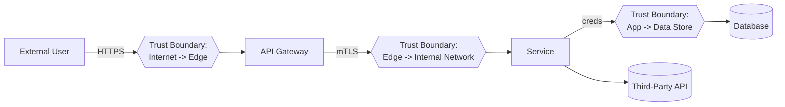
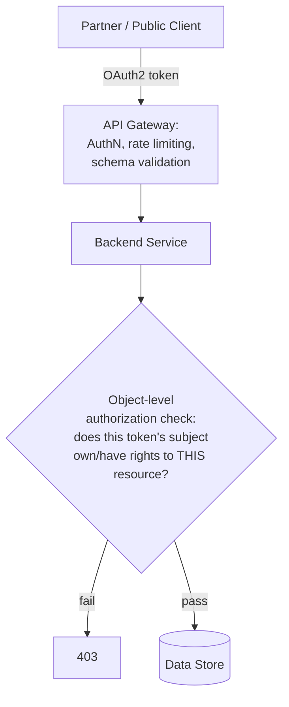
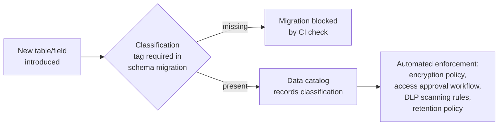
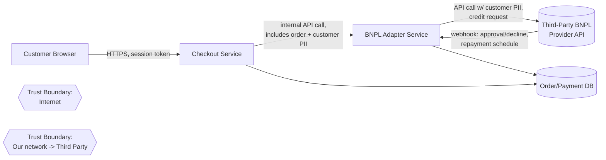
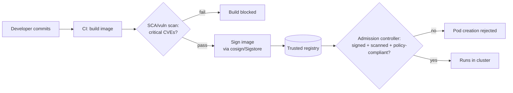
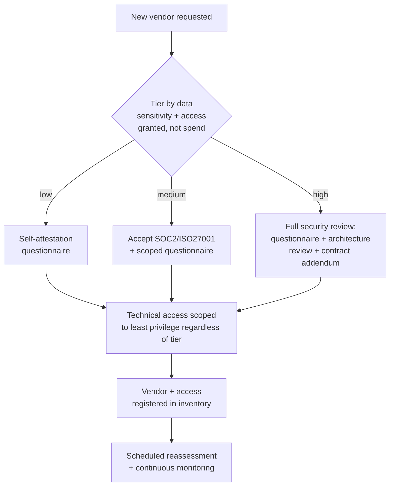
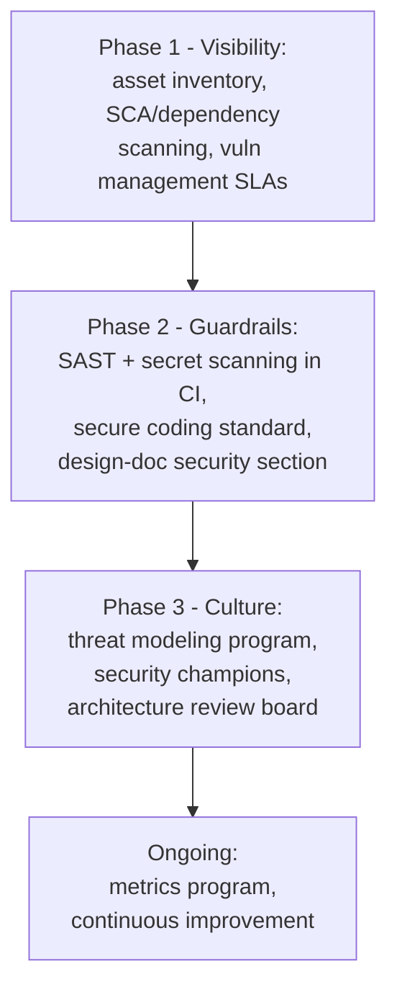

# Security Architect Scenario Based Interview Questions

**Scope note**: Scenarios 1–5 cover the infrastructure/cloud-architecture side of the role. Scenarios 6 onward are aimed squarely at the **Product/Application Security Architect** track — the person embedded with engineering who owns secure-by-design, threat modeling, API security architecture, and scaling security through champions rather than through infra controls alone. References grounding these: OWASP Application Security Verification Standard (ASVS) 5.0, OWASP Developer Guide, OWASP Code Review Guide, CISA's Secure by Design pledge, and general API security architecture practice.

## Table of Contents
1. [Scenario 1: Hybrid Cloud Migration](#scenario-1-hybrid-cloud-migration)
2. [Scenario 2: Vulnerability Response](#scenario-2-vulnerability-response)
3. [Scenario 3: Designing a Secure Application](#scenario-3-designing-a-secure-application)
4. [Scenario 4: Implementing Zero Trust Architecture](#scenario-4-implementing-zero-trust-architecture)
5. [Scenario 5: Securing a Remote Workforce](#scenario-5-securing-a-remote-workforce)
6. [Scenario 6: Standing Up a Threat Modeling Practice Across Engineering](#scenario-6-standing-up-a-threat-modeling-practice-across-engineering)
7. [Scenario 7: Building a Security Champions Program From Scratch](#scenario-7-building-a-security-champions-program-from-scratch)
8. [Scenario 8: Designing a Secure API Architecture for a Public-Facing Platform](#scenario-8-designing-a-secure-api-architecture-for-a-public-facing-platform)
9. [Scenario 9: Operationalizing Secure-by-Design Across the SDLC](#scenario-9-operationalizing-secure-by-design-across-the-sdlc)
10. [Scenario 10: Running a Security Architecture Review Board](#scenario-10-running-a-security-architecture-review-board)
11. [Scenario 11: Securing a Monolith-to-Microservices Migration](#scenario-11-securing-a-monolith-to-microservices-migration)
12. [Scenario 12: Designing a Data Classification and DLP Architecture](#scenario-12-designing-a-data-classification-and-dlp-architecture)
13. [Scenario 13: Building a Security Metrics Program for Leadership](#scenario-13-building-a-security-metrics-program-for-leadership)
14. [Scenario 14: Build vs. Buy for a Secrets Management Platform](#scenario-14-build-vs-buy-for-a-secrets-management-platform)
15. [Scenario 15: Designing Secrets Management Architecture at Scale](#scenario-15-designing-secrets-management-architecture-at-scale)
16. [Scenario 16: End-to-End STRIDE Threat Model Walkthrough — a New "Buy Now, Pay Later" Feature](#scenario-16-end-to-end-stride-threat-model-walkthrough--a-new-buy-now-pay-later-feature)
17. [Scenario 17: Designing a Container and Kubernetes Security Architecture](#scenario-17-designing-a-container-and-kubernetes-security-architecture)
18. [Scenario 18: Building a Third-Party and Vendor Risk Management Architecture](#scenario-18-building-a-third-party-and-vendor-risk-management-architecture)
19. [Scenario 19: Leading Security Due Diligence for an Acquisition](#scenario-19-leading-security-due-diligence-for-an-acquisition)
20. [Scenario 20: Building an Application Security Program From Zero](#scenario-20-building-an-application-security-program-from-zero)

## Scenario 1: Hybrid Cloud Migration

**Question**: Your company is migrating critical services to a hybrid cloud environment. How would you ensure data security and compliance during this migration?

### Answer:

- **Risk Assessment**: Start with a comprehensive risk assessment to identify potential vulnerabilities in the current and new environments.
  - Tools: Use tools like NIST Cybersecurity Framework, and CIS Controls.
  - Output: Document potential risks and corresponding mitigations.

- **Data Encryption**: Implement encryption for data at rest and in transit.
  - Tools: Use encryption tools like AWS KMS, Azure Key Vault, or Google Cloud KMS.
  - Techniques: Apply AES-256 for data encryption and TLS 1.2/1.3 for data in transit.

- **Compliance**: Ensure adherence to relevant regulations (e.g., GDPR, HIPAA).
  - Steps: Regular audits, data classification, and applying specific security controls.
  - Documentation: Maintain an updated compliance matrix.

- **IAM Policies**: Establish robust Identity and Access Management policies.
  - Tools: AWS IAM, Azure AD, Google IAM.
  - Practices: Implement MFA, RBAC, and least privilege access.

- **Monitoring and Logging**: Implement continuous monitoring and logging.
  - Tools: AWS CloudTrail, Azure Monitor, Google Cloud Operations Suite.
  - Setup: Configure alerts for unusual activities and regularly review logs.

## Scenario 2: Vulnerability Response

**Question**: A new vulnerability has been discovered in a critical application used by your organization. As a Security Architect, how would you handle this situation?

### Answer:

- **Assessment and Prioritization**: Assess the severity and impact of the vulnerability.
  - Tools: CVSS scoring, vulnerability management tools like Qualys or Nessus.
  - Output: Determine the urgency based on business impact.

- **Coordination**: Coordinate with development and operations teams for patching.
  - Steps: Schedule patching during maintenance windows to minimize disruption.
  - Tools: Patch management tools like WSUS, SCCM.

- **Mitigation**: Apply temporary mitigations if immediate patching is not possible.
  - Techniques: Network segmentation, application firewalls, disabling vulnerable features.

- **Communication**: Inform stakeholders and provide updates on the remediation process.
  - Steps: Regular status meetings, email updates, incident tracking systems.

- **Post-Incident Review**: Conduct a post-incident review to identify gaps.
  - Tools: RCA (Root Cause Analysis) tools.
  - Output: Implement lessons learned and update security practices.

## Scenario 3: Designing a Secure Application

**Question**: You are tasked with designing a new web application with security as a priority. What steps would you take?

### Answer:

- **Security Requirements Gathering**: Identify and document security requirements.
  - Techniques: Threat modeling, stakeholder interviews.
  - Output: A comprehensive security requirements document.

- **Secure Development Practices**: Incorporate secure coding practices.
  - Techniques: OWASP Secure Coding Practices.
  - Tools: Static code analysis tools like SonarQube, Checkmarx.

- **Authentication and Authorization**: Implement strong authentication and authorization mechanisms.
  - Tools: OAuth 2.0, OpenID Connect, JWT for session management.
  - Practices: Enforce MFA, use RBAC.

- **Data Protection**: Ensure data is protected at rest and in transit.
  - Techniques: AES-256 encryption, TLS for data in transit.
  - Tools: Database encryption features, key management systems.

- **Regular Security Testing**: Conduct regular security testing throughout the development lifecycle.
  - Tools: SAST, DAST tools like OWASP ZAP, Burp Suite.
  - Practices: Continuous integration of security testing in CI/CD pipelines.

## Scenario 4: Implementing Zero Trust Architecture

**Question**: Your organization wants to move to a Zero Trust Architecture. How would you approach this transformation?

### Answer:

- **Assessment and Planning**: Conduct a current state assessment and plan the Zero Trust implementation.
  - Techniques: Gap analysis, defining clear goals and objectives.
  - Output: Zero Trust roadmap.

- **Identity and Access Management**: Strengthen IAM policies.
  - Tools: Identity providers like Okta, Azure AD.
  - Practices: Enforce MFA, context-aware access controls.

- **Network Segmentation**: Implement micro-segmentation to isolate resources.
  - Tools: SDN solutions like VMware NSX, Cisco ACI.
  - Practices: Define granular network policies.

- **Continuous Monitoring**: Establish continuous monitoring and analytics.
  - Tools: SIEM solutions like Splunk, ELK Stack.
  - Practices: Real-time monitoring, anomaly detection.

- **Least Privilege**: Apply the principle of least privilege across the organization.
  - Tools: PAM solutions like CyberArk, BeyondTrust.
  - Practices: Regularly review and adjust access permissions.

## Scenario 5: Securing a Remote Workforce

**Question**: With a significant portion of the workforce now remote, how would you ensure security and compliance?

### Answer:

- **Secure Remote Access**: Implement secure remote access solutions.
  - Tools: VPNs, Zero Trust Network Access (ZTNA) solutions like Zscaler, Perimeter 81.
  - Practices: Use split-tunneling, enforce MFA.

- **Endpoint Security**: Ensure all remote endpoints are secure.
  - Tools: EDR solutions like CrowdStrike, Carbon Black.
  - Practices: Regularly update and patch systems, use disk encryption.

- **Data Protection**: Protect sensitive data accessed remotely.
  - Tools: DLP solutions, encryption tools.
  - Practices: Enforce data classification, restrict data sharing.

- **User Awareness Training**: Conduct regular security awareness training.
  - Topics: Phishing, secure password practices, remote work security tips.
  - Tools: Training platforms like KnowBe4, SANS Security Awareness.

- **Monitoring and Compliance**: Continuously monitor and ensure compliance.
  - Tools: SIEM solutions, compliance management tools.
  - Practices: Regular audits, real-time monitoring of remote access logs.

---

## Scenario 6: Standing Up a Threat Modeling Practice Across Engineering

**Question**: Engineering ships fast and threat modeling currently happens (inconsistently) only when a security engineer has time to join a design review. As the Security Architect, how would you make threat modeling a repeatable, scalable practice across dozens of teams rather than a bottleneck on your own calendar?

### Answer:

- **Pick a methodology and keep it lightweight**: Standardize on **STRIDE** for component/data-flow-level threats (Spoofing, Tampering, Repudiation, Information Disclosure, Denial of Service, Elevation of Privilege) as the default, with **DREAD** or CVSS-based scoring only where teams need a quantified priority order — over-formalizing (mandatory full-blown DFDs for every one-line config change) is the single most common reason threat-modeling programs die from developer fatigue.
  - Output: A one-page "how to threat model in 30 minutes" guide teams can self-serve, not a 40-page process document nobody reads before a deadline.

- **Trigger on risk, not on calendar**: Define objective triggers for *when* a design needs a threat model — new trust boundary, new data classification touched, new third-party integration, new authentication/authorization pattern, significant architecture change — rather than "every project" (unsustainable) or "only when someone remembers" (what's happening today).
  - Output: A short intake checklist embedded in the design-doc template itself, so the trigger decision happens automatically as part of normal planning, not as a separate security gate someone has to remember to request.

- **Shift threat modeling left into the team, not just onto you**: Train engineers and security champions (see Scenario 7) to run their own first-pass threat model using a lightweight worksheet, with the security architect reviewing/coaching rather than authoring from scratch every time — this is what actually scales past the point where one architect's calendar is the bottleneck.
  - Tools: Threat-modeling aids like Microsoft's Threat Modeling Tool or OWASP Threat Dragon for teams that want a DFD canvas; a simple shared spreadsheet/template works fine for teams that don't.

- **Make the data-flow diagram the shared artifact, not the threat list**: Insist every threat model starts with a simple DFD showing trust boundaries — that single artifact is what turns "we think this is secure" into a structured conversation, because most missed threats come from an undocumented trust boundary, not from a clever attacker technique nobody could have predicted.



- **Close the loop with tracked findings, not a one-time document**: Every threat model output needs to land as tracked tickets with owners and due dates in the same backlog the team already uses (Jira, not a PDF that gets archived) — a threat model that doesn't produce enforced action items is a compliance exercise, not a security control.

- **Measure adoption, not just quality**: Track % of qualifying projects that got a threat model before launch, average time-to-remediate findings, and recurring threat categories across teams (a pattern like "everyone keeps missing SSRF on the outbound webhook feature" is itself an architecture-level signal — fix it with a shared library/pattern, not by re-explaining it in every review).

---

## Scenario 7: Building a Security Champions Program From Scratch

**Question**: Your security team is 5 people supporting 60 engineering teams. Leadership asks you to scale security influence without 10x-ing headcount. How do you design and launch a security champions program that actually works, rather than becoming a title with no substance?

### Answer:

- **Define the role concretely before recruiting anyone**: A champion is not "the person who does what the security team says" — they're an embedded engineer who spends a defined % of their time (commonly 10–20%) as the first line of security triage and context for their team: reviewing designs for obvious gaps, answering "is this safe" questions before they escalate, and being the conduit for security team guidance landing in a form their team will actually adopt.
  - Output: A one-page charter defining responsibilities, expected time commitment, and — critically — what a champion is explicitly *not* responsible for (they are not the team's incident responder or a substitute for a real security review on high-risk work).

- **Get manager buy-in on time allocation before launch**: The single most common reason champions programs fail is that the champion's manager never actually carved out the promised time, so the role becomes unpaid extra work the person quietly drops under deadline pressure — get the % time commitment written into the champion's actual goals/OKRs with their manager's sign-off, not just a verbal agreement with the champion themselves.

- **Make the incentive structure real**: Visibility (recognition from leadership, a defined career-development angle — many champions use it as a stepping stone toward a security role), access (a direct line to the security team, early access to new tooling/training), and light-but-real perks (dedicated training budget, a distinct badge/title recognized in performance reviews) — a program that's 100% obligation and 0% benefit has high turnover.

- **Structure recurring engagement, don't let it go dormant**: A regular (bi-weekly or monthly) champions sync covering new threats/techniques relevant to your stack, a recap of recent incidents/near-misses (sanitized, blameless) with the "why," and a forum for champions to raise friction points with existing security tooling/process directly to the team that owns it.

- **Give champions something concrete to do in their first 30 days**: A lightweight onboarding task list — run a threat model on their own team's next design doc with security-architect coaching, complete a foundational secure-coding training, do a walk-through of your SAST/SCA findings dashboard for their own service — so the role has early, tangible wins rather than an ambiguous "be more security-minded" mandate.

- **Measure program health, not just headcount of champions**: Track champion retention/turnover, the volume and quality of design reviews/threats caught at the champion level before escalating to the core team, and — the leading indicator that actually matters — whether the *core security team's* review queue depth is trending down as champion coverage matures, which is the actual ROI case leadership is asking you to prove.

---

## Scenario 8: Designing a Secure API Architecture for a Public-Facing Platform

**Question**: Your company is exposing a set of previously-internal-only APIs to third-party partners and, eventually, the public. As the security architect, how do you design the security architecture around this?

### Answer:

- **Start from an API inventory and classification, not from the gateway config**: You cannot secure what you don't know exists — build (or validate) a complete API inventory (including "shadow"/undocumented internal APIs that predate any governance) and classify each by data sensitivity and exposure tier (internal-only, partner, public) before designing controls, since the controls differ meaningfully by tier.
  - Tools: API discovery/inventory tooling integrated with your API gateway and service mesh; treat this the same way you'd treat an asset inventory for any other security domain.

- **Centralize authentication/authorization at the gateway, but don't stop there**: Enforce OAuth 2.0 / OpenID Connect at the API gateway for coarse-grained access control (who can call this API family at all), but implement **fine-grained, resource-level authorization inside each service** — the classic API security failure (OWASP API1: Broken Object Level Authorization) happens precisely because teams assume gateway-level auth is sufficient and skip the "does this specific caller have rights to *this specific* object" check inside the service itself.



- **Enforce a schema contract, not "trust the client"**: Require and validate an OpenAPI/JSON-Schema contract at the gateway for every endpoint (reject requests with unexpected fields, wrong types, oversized payloads) — this closes a large class of injection and mass-assignment issues before they ever reach application code, and it's a cheap, high-leverage control relative to trying to catch every case downstream.

- **Rate limit and quota by identity, not just by IP**: Public/partner APIs need per-client-identity quotas (not just a blanket IP-based rate limit) to prevent both abuse and the "denial of wallet" failure mode from resource-heavy endpoints, with tighter limits for unauthenticated/low-trust tiers and headroom for verified, contracted partners.

- **Version and deprecate deliberately**: Define an explicit API versioning and deprecation policy up front — a huge fraction of real-world API breaches happen through **old, undocumented, or "internal only" versions of an endpoint that were never actually decommissioned** (OWASP API9: Improper Inventory Management) after a newer, better-secured version shipped.

- **Log and monitor at the API layer specifically**: Standard infrastructure logging misses API-specific abuse patterns (excessive object enumeration, sequential ID scraping, unusual parameter combinations) — invest in API-aware monitoring/anomaly detection, not just generic WAF/network logs, and make sure logs capture enough context (caller identity, resource accessed, not just status code) to actually investigate an incident after the fact.

- **Contractually and technically bound third-party partners**: For partner-tier APIs, pair the technical controls above with a security addendum in the partnership agreement (data handling requirements, breach notification SLAs, right to audit) — a partner's security posture becomes your incident the moment their credentials are compromised, so the technical and contractual controls need to be designed together, not as separate legal vs. engineering workstreams.

---

## Scenario 9: Operationalizing Secure-by-Design Across the SDLC

**Question**: Leadership has publicly committed to CISA's Secure by Design principles. Your job is to turn that commitment into something engineering teams actually do differently day to day, not just a statement on a webpage. How do you approach it?

### Answer:

- **Translate the pledge into specific, measurable engineering commitments**: "Secure by Design" as a philosophy (security is a property designed in, not bolted on; the burden of security should shift from the customer/user to the manufacturer/vendor) needs to become concrete practices your teams can actually execute — e.g., committing to measurable reductions in specific vulnerability classes (memory-safety issues, default credentials, SQL injection) rather than a vague cultural aspiration.
  - Output: A short internal mapping document showing exactly which of your existing (or new) engineering practices satisfy each pledge commitment, so progress is auditable rather than aspirational.

- **Bake security requirements into the earliest design artifact, not into a later gate**: Security requirements (authN/authZ model, data classification, threat model trigger per Scenario 6) become a mandatory section of the design-doc template itself — the goal is that a design doc without a security section is structurally incomplete, the same way a design doc without a rollback plan would be considered incomplete, rather than security being a separate review that happens after the design is already "done."

- **Choose secure defaults and make the insecure path harder than the secure one**: This is the core of secure-by-design in practice — e.g., a new service template that ships with authentication enabled, TLS enforced, and least-privilege IAM roles pre-configured by default, so a team has to deliberately opt out of security rather than deliberately opt in. Paved-road internal platforms/libraries that handle auth, secrets access, and logging correctly out of the box do more for your security posture at scale than any amount of after-the-fact code review.

- **Reduce entire vulnerability classes structurally rather than fixing instances**: Favor memory-safe languages for new greenfield services where feasible, parameterized-query-only database access libraries (make raw string-concatenated SQL simply unavailable in your standard tooling), and centrally-managed cryptography (no team hand-rolls their own crypto or picks their own JWT library configuration) — per OWASP's Developer and Code Review guidance, structural elimination of a bug class scales far better than review-driven catch-and-fix of individual instances.

- **Integrate security tooling into the CI/CD pipeline as a quality gate, not an afterthought scan**: SAST, SCA/dependency scanning, and secret scanning run automatically on every PR with a defined, negotiated bar for what blocks a merge versus what's tracked as debt — the point of secure-by-design is that insecure code becomes *hard to ship*, not just *detectable after it ships*.

- **Report progress transparently, including where you're behind**: Publish (internally, and per the pledge's spirit, eventually externally where appropriate) a scorecard against the specific commitments you made — MFA adoption rate, CVE-class reduction trends, time-to-patch for critical vulnerabilities — because the credibility of a secure-by-design commitment rests on showing real, even imperfect, progress rather than a one-time announcement.

---

## Scenario 10: Running a Security Architecture Review Board

**Question**: New services and major architecture changes currently ship with no consistent security review — some get a thorough look, most get none, purely based on who happened to notice. How would you design and run a Security Architecture Review process that's rigorous but doesn't become the org's biggest bottleneck?

### Answer:

- **Right-size the review to the risk tier, not one-size-fits-all**: Define 2–3 review tiers based on objective criteria (new trust boundary, PII/regulated data, internet-facing, new third-party dependency with broad access) — low-risk changes get an async, self-service checklist; high-risk changes get a scheduled synchronous review with the architecture board; most changes should land in the lightweight tier, or the board becomes exactly the bottleneck you're trying to avoid.

- **Review the architecture, not the implementation**: The board's job is trust boundaries, data flow, authentication/authorization model, and blast radius of a compromise — not line-by-line code review (that's SAST/manual code review's job) and not re-litigating product decisions already made — scope creep into either direction is the fastest way to make the board slow and resented.

- **Require a lightweight, standard submission artifact**: A one-to-two-page design doc with a DFD (Scenario 6), explicit data classification, and a filled-in threat model summary is the entry ticket to a review slot — reviewing a vague verbal description wastes the board's time and produces weak findings; a standard template also lets less-senior reviewers meaningfully participate because the format is familiar.

- **Make the board's authority and escalation path explicit up front**: Decide and publish whether the board can actually block a launch, or only advise with an escalation path to a named executive for risk acceptance when a team disagrees — an architecture review with no teeth becomes theater, but one with unclear authority creates constant political friction; clarity here (decided once, not re-negotiated per review) is what makes the process durable.

- **Track findings and, more importantly, recurring findings as an architecture signal**: A single team missing rate limiting is a finding; **five different teams independently missing rate limiting** is a gap in your platform/paved-road, not five separate team failures — feed recurring patterns back into shared libraries, the service template (Scenario 9), and champion training (Scenario 7) rather than re-explaining the same fix in review after review.

- **Set and honor an SLA for the board itself**: Teams need a committed turnaround time (e.g., "high-risk reviews scheduled within 5 business days") — a review board that becomes an unpredictable multi-week wait will get bypassed by teams shipping around it, which defeats the entire purpose regardless of how good your review criteria are.

---

## Scenario 11: Securing a Monolith-to-Microservices Migration

**Question**: Your organization is breaking apart a large monolith into microservices over the next 18 months. As the security architect, what's your approach to making sure the security posture doesn't regress during the transition?

### Answer:

- **Recognize that the migration itself is a new, temporary attack surface**: The monolith's implicit trust (everything runs in one process, one deployment, one set of credentials) gets replaced by an explicit network of service-to-service calls — every one of those new calls is a new trust boundary that didn't exist before, and the transition period (part monolith, part services, calling each other) is often *less* secure than either the fully-monolithic starting point or the fully-decomposed end state, so plan security work as a first-class migration workstream, not a follow-up cleanup after the "real" migration is done.

- **Design service-to-service authentication before the first service is extracted**: Decide the pattern up front — mutual TLS via a service mesh (Istio/Linkerd), or signed service-identity tokens validated at each hop — rather than letting each extracted service invent its own ad hoc internal-trust assumption ("it's internal traffic, so no auth needed" is exactly the assumption that turns a single compromised service into full lateral movement across the whole new architecture).

- **Carry forward authorization logic deliberately, don't assume it "just moves"**: The monolith likely had authorization checks implicit in shared code paths and a single database's row-level access patterns; when a service is extracted, that authorization logic needs to be explicitly re-implemented and re-verified in the new service boundary — this is one of the most common places real vulnerabilities get introduced during decomposition, because the check was there in spirit but nobody explicitly ported it.

- **Decompose secrets and data access alongside the services, on the same timeline**: A monolith-wide database credential or shared secret becomes a serious over-privileged blast radius the moment it's inherited unchanged by a dozen new independent services — plan credential/secret decomposition (least-privilege, per-service credentials via a secrets manager) as part of each extraction, not as a "we'll get to it later" cleanup item that never happens once the extraction is declared done.

- **Threat model each extraction, scaled to its risk (tie back to Scenario 6)**: Not every service extraction needs a full board review (Scenario 10), but every one crossing a new trust boundary or touching sensitive data should get at least the lightweight threat-modeling pass — extractions are exactly the "new trust boundary" trigger condition that should route into your existing threat-modeling program rather than being treated as routine refactoring.

- **Keep the observability and incident-response story coherent through the transition**: A single monolith has one log stream and one obvious place to look during an incident; a partially-decomposed system has requests crossing many services, and if distributed tracing/correlated logging isn't in place from early in the migration, your ability to investigate an incident (or even notice one) degrades significantly right when the attack surface is at its most complex — instrument this early, not as an afterthought once services are already in production.

- **Set an explicit security exit criterion for "done"**: Define what "the migration is secure" means concretely (service-to-service auth in place org-wide, no service running with monolith-era broad credentials, no unauthenticated internal endpoints) and track it as a real, reported metric alongside the functional migration milestones — an 18-month migration with no security checkpoint until the very end guarantees you find the gaps at the worst possible time.

---

## Scenario 12: Designing a Data Classification and DLP Architecture

**Question**: Your organization has grown fast and nobody can tell you, with confidence, where all the customer PII actually lives, or which of the 200+ internal services touch regulated data. Leadership wants a data classification and loss-prevention program. Where do you start, and how do you architect it so it actually gets maintained?

### Answer:

- **Start with discovery, because you can't classify what you can't find**: Before writing a single classification policy, run automated data discovery/scanning across databases, object storage, data warehouses, and logging pipelines to build a real inventory of where sensitive data actually lives — a classification policy written before discovery is a guess dressed up as a program, and it will be wrong in exactly the places that matter most.
  - Tools: DSPM (Data Security Posture Management) tooling, cloud-native discovery (AWS Macie, GCP DLP API, Azure Purview), or a targeted internal crawler if budget doesn't stretch to a commercial platform yet.

- **Keep the classification scheme small and decision-relevant**: 3–4 tiers (e.g., Public, Internal, Confidential, Restricted/Regulated) tied to concrete, different handling requirements per tier — encryption requirements, access approval workflow, retention period, logging requirements — a scheme with 12 nuanced categories that all get treated identically in practice is pure overhead; the test for a good scheme is "does this tier change what an engineer actually has to do differently."

- **Attach classification to the data at the schema/metadata level, not to a wiki page**: Tag columns/fields in the data warehouse and object storage with classification metadata programmatically (via your data catalog) so that access controls, encryption policy, and DLP rules can be **enforced from that metadata automatically**, rather than relying on every engineer remembering and correctly applying a policy document — classification that lives only in documentation decays within a quarter as schemas evolve.

- **Make classification part of the schema-change process, not a periodic audit**: Require new tables/fields touching a schema registry to declare a classification tag as part of the PR/migration — the same "shift left, make the secure/compliant path the default path" principle from Scenario 9's secure-by-design approach, applied to data governance instead of code security.



- **Layer DLP controls by channel, matched to actual exfiltration paths**: Egress DLP scanning on outbound email/Slack/file-sharing for Restricted-tier data patterns, database activity monitoring for bulk/anomalous query patterns against regulated tables, and API-layer response scanning for accidental over-exposure (a service returning more fields than the caller's classification tier should see) — a DLP program that only covers email is only covering one exfiltration channel out of many realistic ones.

- **Design for false-positive fatigue from day one**: An overly aggressive DLP rule set that blocks legitimate business workflows trains employees to route around it (personal email, unmanaged file shares) — tune rules against real traffic samples before enforcing in blocking mode, start most new rules in detect-only/alert mode, and only promote to blocking once the false-positive rate is proven low enough not to generate workaround behavior.

- **Tie the whole program to an ownership model, or it decays**: Assign a named data owner per major dataset/domain (not "the security team owns all data classification," which doesn't scale and puts context-free security engineers in the position of guessing business sensitivity) — the security architect's job is to build the platform/tooling and set the policy framework; the actual classification judgment calls belong with people who understand the data's business context.

---

## Scenario 13: Building a Security Metrics Program for Leadership

**Question**: Your CISO asks you to build a monthly security metrics dashboard for the executive team and the board. What do you include, and how do you avoid the common trap of reporting numbers that look good but don't actually tell leadership anything decision-relevant?

### Answer:

- **Separate leading indicators from lagging indicators, and report both deliberately**: Lagging indicators (number of incidents, breach cost, audit findings) tell you what already happened; leading indicators (% of services with a completed threat model, mean time to patch critical vulnerabilities, SAST/SCA finding burn-down rate, security champion coverage per Scenario 7) tell you whether the *trend* is improving — a report that's 100% lagging indicators reads like a scoreboard after the game is already lost, with nothing actionable for the next quarter.

- **Avoid vanity metrics that always look good regardless of actual risk posture**: "Number of security trainings completed" or "number of vulnerabilities scanned for" measures activity, not outcome — prefer metrics that can actually go *down* in a way that reflects real improvement, like "median time from vulnerability discovery to remediation for critical findings" or "% of internet-facing services with a completed architecture review," which can meaningfully worsen if the org is neglecting security and meaningfully improve if it's investing well.

- **Frame every metric in business risk language, not security jargon**: A board doesn't need "we reduced our XSS finding count by 30%" — they need "our exposure to a category of attack that led to $X industry losses last year dropped by 30%, and here's the remaining gap and what it would cost to close it." The translation from technical metric to business risk narrative is the actual skill being tested here, not the metric collection itself.

- **Segment metrics by audience — the board deck is not the engineering leadership deck**: The board wants a small number (5–7) of trend lines tied to material risk and regulatory exposure, reviewed quarterly; engineering leadership wants team-level, actionable detail (which services are behind on patching, which teams' champion coverage is thin) reviewed monthly — sending the same dense dashboard to both audiences under-serves one or both.

- **Include a benchmark or target, not just a number in isolation**: "73% of critical vulnerabilities patched within SLA" means nothing without the target (e.g., 95%) and the trend line — a raw number invites the question "is that good?" which you want answered by the chart, not by you having to explain it live every single time.

- **Report gaps and risk-acceptance decisions honestly, not just wins**: A metrics program that only ever shows improving trends loses credibility fast, and more importantly hides exactly the information leadership needs to make resourcing decisions — explicitly surface where you're behind target, why, and what resourcing/prioritization decision would close the gap, framed as a decision leadership can act on rather than a complaint.

- **Automate collection, or the program dies the first time you're busy**: A metrics program that depends on someone manually pulling numbers from five different tools every month before a deadline will quietly stop happening or start being padded/estimated under time pressure — invest in pulling these metrics automatically from your SAST/SCA/vulnerability-management/ticketing systems into a live dashboard, with the monthly narrative as the only manual step.

---

## Scenario 14: Build vs. Buy for a Secrets Management Platform

**Question**: Secrets (API keys, database credentials, service tokens) are currently scattered across environment variables, config files in repos, and a couple of ad hoc scripts. You're asked to fix this. How do you approach the build-vs-buy decision, and what's your evaluation framework?

### Answer:

- **Start from requirements, not from a vendor comparison spreadsheet**: Define what the platform actually needs to do before evaluating any option — dynamic secret generation/rotation, fine-grained access policies tied to your existing identity system, audit logging of every secret access, integration with your CI/CD and container orchestration, and multi-cloud/on-prem support if applicable — evaluating vendors before requirements means you'll pick based on whoever's sales demo was most polished rather than actual fit.

- **Default to buy for this specific control, and know why**: Secrets management is a mature, well-solved problem with strong existing products (HashiCorp Vault, AWS Secrets Manager, Azure Key Vault, GCP Secret Manager, CyberArk Conjur) — building your own secrets store means owning the hardest parts of that problem yourself (secure storage, key rotation, HA/DR for a system every other system now depends on, audit-grade logging) with no differentiated business value from doing it in-house; this is squarely a "buy the commodity control, save your engineering effort for what actually differentiates your product" decision.

- **The real architecture decision is usually integration depth, not vendor selection**: Once you've picked a platform, the harder and more consequential work is *how deeply* it integrates — sidecar injection vs. SDK-based fetch vs. init-container pattern for Kubernetes workloads, how CI/CD pipelines authenticate to fetch secrets without themselves becoming a long-lived credential store, and how legacy systems that can't be easily modified get bridged in — this integration design is where most of the actual engineering and security judgment goes, not the product selection itself.

- **Weigh operational cost honestly, both ways**: A self-hosted solution (e.g., self-managed Vault) gives you full control and avoids per-secret/per-request vendor pricing at scale, but adds real operational burden (HA setup, unsealing/key-management procedures, upgrade cadence, your team now on-call for an infrastructure dependency everything else relies on); a managed cloud-native option (AWS Secrets Manager) reduces operational burden but can create cost surprises at scale and tighter coupling to one cloud provider — make this trade-off explicit in the decision doc rather than defaulting to whichever option is more familiar to the current team.

- **Plan the migration as a phased rollout, not a flag-day cutover**: Migrating "everything scattered across env vars and config files" in one shot is high-risk; sequence by blast radius — start with the highest-risk secrets (production database credentials, payment-processor keys) and lowest-complexity services, prove the pattern, then expand — while running detection (secret-scanning in CI, per the `secret-scan` discipline) throughout the migration to catch new hardcoded secrets being introduced even as you're migrating old ones out.

- **Set a hard deprecation date for the old pattern, or it never fully goes away**: Without an explicit sunset date and enforcement mechanism (e.g., CI fails a build that references a secret via the old environment-variable pattern past a cutoff date), migrations like this tend to reach "80% done" and stay there indefinitely, leaving the org maintaining both the new secure pattern and the old insecure one forever — plan the enforcement mechanism as part of the initial rollout plan, not as a future cleanup task.

---

## Scenario 15: Designing Secrets Management Architecture at Scale

**Question**: You've selected a secrets management platform (continuing from Scenario 14). Now design the actual architecture: how do hundreds of services across multiple environments and a CI/CD pipeline authenticate to it, retrieve secrets, and rotate them safely?

### Answer:

- **Solve the bootstrap problem explicitly — "a secret to get your secrets" can't itself be a static credential**: Use platform-native identity for authentication to the secrets store wherever possible — Kubernetes service account tokens, cloud IAM roles (AWS IRSA, GCP Workload Identity), or a CI/CD platform's native OIDC federation — so that a workload's *identity* (not a long-lived, separately-managed credential) is what authorizes secret retrieval; this eliminates the recursive problem of needing to securely distribute the credential that unlocks all your other credentials.

```mermaid
flowchart TD
    POD[Kubernetes Pod] -->|Service account token\n(short-lived, platform-issued)| VAULT[Secrets Platform]
    CI[CI/CD Pipeline] -->|OIDC federation token\n(no long-lived CI secret)| VAULT
    VAULT -->|Policy check:\nidentity -> allowed secret paths| POLICY{Access Policy}
    POLICY -- allowed --> SECRET[Dynamic, short-lived\nsecret issued]
    POLICY -- denied --> DENY[Access denied,\nlogged]
    SECRET --> POD
    SECRET --> CI
```

- **Prefer dynamic, short-lived secrets over static long-lived ones wherever the backend supports it**: Database credentials generated on-demand per workload with a short TTL (rather than one static shared DB password used everywhere) mean a leaked credential is worthless within minutes/hours instead of remaining a standing risk until someone notices and manually rotates it — this single architectural choice eliminates an entire category of "we found an old leaked credential from 8 months ago that's still valid" incidents.

- **Scope access policy per-service, per-environment, per-secret-path — least privilege applied to secrets specifically**: A service should be able to authenticate and retrieve only the specific secrets it needs for its own function, in its own environment (a staging workload should never be able to fetch a production secret even if it somehow has valid platform identity) — broad "any authenticated service can read any secret" policies turn one compromised service into a skeleton key for the whole secrets estate.

- **Design rotation to be automatic and non-disruptive, not a manual fire-drill**: Automated rotation on a defined schedule (and immediately on suspected compromise) requires the consuming applications to handle credential refresh gracefully (short-lived credential + refresh-before-expiry pattern, or a sidecar that handles rotation transparently) — a rotation process that requires manually redeploying every consuming service is one that will quietly stop happening under operational pressure, defeating the point of having rotation capability at all.

- **Audit every access, and alert on the anomalies, not just log them**: Every secret retrieval should be logged with the requesting identity, the secret path, and timestamp, feeding into anomaly detection (a service suddenly requesting secrets it's never accessed before, unusual access volume/timing, access from an unexpected environment) — this audit trail is also what makes a "was this secret compromised" incident investigation (see the AI-side equivalent in the incident-response scenario in the AI security guide) tractable instead of a guessing exercise.

- **Handle the break-glass case deliberately, don't leave it undesigned**: There will be a legitimate emergency where a human needs direct access to a production secret outside the normal automated path — design this as an explicit, heavily audited, time-boxed, MFA-gated break-glass procedure rather than leaving a permanent "just in case" standing admin credential lying around, which is what actually happens when this case isn't designed for up front.

- **Treat the secrets platform itself as your highest-blast-radius single point of failure**: Its own high-availability design, backup/disaster-recovery procedure, and the security of *its* administrative access deserve the most scrutiny of anything in your architecture — if the secrets platform goes down, potentially everything downstream that depends on dynamic credential issuance goes down or fails open/closed in ways you need to have explicitly decided on, not discovered during the outage.

---

## Scenario 16: End-to-End STRIDE Threat Model Walkthrough — a New "Buy Now, Pay Later" Feature

**Question**: Walk me through, concretely, how you'd threat model a new feature: customers can split a purchase into 4 installments, with a new third-party BNPL provider handling credit decisioning and repayment collection. Don't just name the methodology — actually run it.

### Answer:

- **Step 1 — Build the data-flow diagram and mark trust boundaries first**: Before enumerating a single threat, get the architecture on paper (or a whiteboard) with every component and every place data crosses a boundary of trust or control — this is the step teams most often skip or rush, and it's the step that determines whether the rest of the exercise finds real issues or busywork threats.



- **Step 2 — Walk every component and every data flow through STRIDE systematically, not just "brainstorm threats"**: For each element crossing a trust boundary, ask all six STRIDE questions deliberately rather than free-associating — the discipline of going through each category for each component is what catches the non-obvious threats a free-form brainstorm misses.

  | STRIDE Category | Applied here |
  |---|---|
  | **Spoofing** | Can an attacker forge the BNPL provider's approval webhook to fake an "approved" decision without a real credit check? (Webhook authenticity — is it signed and verified, or just trusted because it arrived on the expected endpoint?) |
  | **Tampering** | Can the order amount or customer identity be modified in transit between checkout and the BNPL adapter, or between the adapter and the provider, without detection? |
  | **Repudiation** | If a customer disputes "I never agreed to this installment plan," do we have tamper-evident, timestamped consent logging sufficient to resolve the dispute? |
  | **Information Disclosure** | The BNPL adapter sends customer PII (name, address, possibly partial SSN/income data for credit decisioning) to a third party — is this data minimized to only what's needed, and is it encrypted in transit and logged safely (not landing in plaintext debug logs)? |
  | **Denial of Service** | If the third-party BNPL provider's API is slow or down, does checkout fail open (customer can't complete purchase at all) or does our system have a safe degraded mode, and can a flood of BNPL applications be used to exhaust our own or the provider's rate limits as an attack vector? |
  | **Elevation of Privilege** | Can a customer manipulate the BNPL adapter's API (e.g., replaying or modifying a request) to get approved for a larger installment amount or a different credit tier than their actual decisioning result? |

- **Step 3 — Prioritize findings by actual business impact, not by how interesting the attack is**: The webhook-forgery finding (Spoofing) that lets an attacker get free merchandise approved with no real credit check is a **critical, launch-blocking** finding; a theoretical timing side-channel in the credit-decisioning API response is **low priority** for this specific launch — prioritization judgment, not threat enumeration completeness, is what separates a useful threat model from an exhaustive but unprioritized list nobody acts on.

- **Step 4 — Translate each finding into a concrete, assigned mitigation, not a vague recommendation**: "Verify webhook signatures" becomes a specific ticket: implement HMAC signature verification on the BNPL provider's webhook payload using the shared secret from the provider's integration docs, reject unsigned/invalid-signature webhooks, and add a monitoring alert for signature-validation failures (which would indicate either a misconfiguration or an active spoofing attempt) — assigned to a named engineer with a due date before the launch review, not left in the threat-model document as a good idea.

- **Step 5 — Decide what blocks launch versus what's tracked as accepted/scheduled risk**: Not every finding gets fixed before ship — the webhook-forgery and PII-minimization findings are launch blockers given this feature handles money and regulated financial data; the DoS-degraded-mode design might be accepted as a tracked risk with a committed follow-up date if the provider's SLA makes it low-likelihood — document explicitly which is which, and who accepted the risk, so this decision is auditable later rather than an ambiguous "we knew about it" if something goes wrong.

- **Step 6 — Re-run the delta, not the whole exercise, when the design changes**: If the BNPL provider integration changes (e.g., they later add a new webhook type, or the adapter starts caching credit decisions), threat model *that specific change* against the existing DFD rather than assuming the original model still fully covers it — this is what keeps threat modeling sustainable as a recurring practice (tying back to Scenario 6) instead of a one-time pre-launch exercise that goes stale the moment the feature evolves.

---

## Scenario 17: Designing a Container and Kubernetes Security Architecture

**Question**: Your platform team is standardizing on Kubernetes for all new services. As the security architect, what does "secure by default" look like for this platform, and how do you make sure individual teams can't quietly opt out of it?

### Answer:

- **Secure the supply chain before the cluster — a hardened cluster running a compromised image is still compromised**: Enforce a signed, scanned base-image pipeline (mandatory SCA/vulnerability scanning at build time, blocking on critical CVEs, image signing via Sigstore/cosign) and admission-control policy that **refuses to run any image that isn't signed and scanned** — this closes the "someone pulled a random public image straight from Docker Hub into production" gap that no amount of runtime hardening fixes after the fact.



- **Make Pod Security Standards and network policy the default, not opt-in per namespace**: Apply the "restricted" Pod Security Standard (no privileged containers, no host namespace/network access, non-root, read-only root filesystem where feasible) at the cluster level via admission control, and default every namespace to a **deny-all NetworkPolicy** that teams must deliberately open specific paths from — defaulting to permissive and asking teams to lock down later never happens at scale; defaulting to restrictive and letting teams request specific exceptions does.

- **Scope RBAC and service accounts per-workload, never share a broad service account across unrelated services**: Every workload gets its own service account with only the Kubernetes API permissions and cloud IAM bindings (via IRSA/Workload Identity, tying back to Scenario 15's identity-based secrets bootstrap) that its specific function needs — a shared "apps" service account with broad `cluster-admin`-adjacent permissions turns any single compromised pod into a cluster-wide incident.

- **Treat the control plane and etcd as the crown jewels they are**: API server access restricted to a private network with strong authentication (no public internet-exposed API server), etcd encrypted at rest and its access tightly scoped (etcd contains every Secret in the cluster in near-plaintext-equivalent form if not properly encrypted) — a surprising number of real-world Kubernetes compromises trace back to an exposed, weakly-authenticated API server or unencrypted etcd, which is a fully preventable, well-understood gap.

- **Instrument for runtime detection, not just admission-time prevention**: Prevention (image scanning, admission control, RBAC) stops known-bad patterns before they run; runtime security tooling (Falco or equivalent) detects the unknown-bad — a process spawning a shell inside a container that should never do that, unexpected outbound network connections, privilege escalation attempts — because admission control alone can't catch a legitimate image being exploited after it's already running.

- **Build the guardrails into the platform, so teams get security for free rather than as homework**: Ship a standard Helm chart / Kustomize base / internal "platform as a product" starting point that already has the Pod Security Standard, default network policy, and scoped service account correctly configured — the same paved-road principle from Scenario 9, applied specifically to the Kubernetes platform layer, so secure configuration is the path of least resistance rather than a checklist a busy team skips under deadline pressure.

- **Prevent policy drift with continuous compliance scanning, not just admission-time checks**: Configuration can drift after deployment (a team manually patches a running deployment to add a capability, an emergency fix loosens a network policy and nobody reverts it) — run continuous policy-as-code scanning (OPA/Gatekeeper, Kyverno policies evaluated on a schedule, not just at admission) against the live cluster state to catch drift from the intended baseline.

---

## Scenario 18: Building a Third-Party and Vendor Risk Management Architecture

**Question**: Your company works with 300+ vendors, ranging from a payroll SaaS provider to a subprocessor that touches customer PII to a marketing analytics tag embedded directly in your website's frontend. How do you architect a third-party risk program that's rigorous where it needs to be and doesn't grind procurement to a halt everywhere else?

### Answer:

- **Tier vendors by access and data sensitivity, not by contract size**: A $2M enterprise software deal with no data access is lower risk than a $200/month tool that gets a service account with broad API access to your customer database — build the tiering criteria around **what the vendor can actually touch or see** (data classification touched, network/API access granted, whether they're a subprocessor for regulated data) rather than around procurement's existing spend-based approval thresholds, which measure the wrong thing entirely for security risk.

- **Right-size due diligence depth to the tier, the same principle as Scenario 10's review-board tiering**: Low-tier vendors (no data access, no system integration) get a lightweight self-attestation questionnaire; high-tier vendors (subprocessors touching regulated data, deep system integration, broad API access) get a full review — security questionnaire (or accept a current SOC 2 Type II / ISO 27001 report in lieu of re-deriving the same answers), architecture review of the actual integration, and a contractual security addendum — applying full-depth review to all 300 vendors uniformly guarantees the program either never finishes or gets rubber-stamped without real scrutiny.

- **Architect the technical integration for least privilege regardless of how much you trust the vendor**: Scope API keys/OAuth grants given to a vendor integration to only the specific data and actions required (a marketing analytics vendor gets event data, not full customer PII access; a payroll vendor's API access is scoped to payroll data only, not the broader HR system) — trusting a vendor contractually doesn't reduce your technical blast radius if their systems are later compromised, so the access-scoping decision has to be made independent of how much you trust them.



- **Maintain a living vendor and integration inventory, tied to your data classification work from Scenario 12**: You need to be able to answer "which vendors have access to this data category" instantly during an incident (a vendor breach elsewhere in the industry, or your own incident investigation) — an inventory that only exists at onboarding time and never gets updated as integrations change becomes useless exactly when you need it most.

- **Continuously monitor rather than one-time-approve and forget**: A vendor's security posture at onboarding doesn't guarantee their posture two years later — track vendor security incidents/breach disclosures (via threat intel feeds or simple news monitoring for high-tier vendors), require periodic re-attestation (annual SOC 2 renewal review at minimum for high-tier vendors), and re-review any vendor whose scope of access materially expands.

- **Build the frontend/JavaScript-tag risk into the same program, since it's an easy blind spot**: Third-party scripts embedded directly in your website (analytics, chat widgets, ad tech) run with the same origin privileges as your own frontend code and are a real, frequently-overlooked class of supply-chain risk (Magecart-style skimming attacks specifically target this) — apply Subresource Integrity (SRI) and a strict Content-Security-Policy to constrain what embedded third-party scripts can actually do, and include frontend script vendors in the same tiering/review process as backend integrations rather than treating "it's just a tracking pixel" as exempt from review.

- **Design the offboarding process with the same rigor as onboarding**: Access revocation, data return/deletion confirmation, and removal from the active inventory when a vendor relationship ends — a huge fraction of real third-party risk exposure comes from **stale access that was never revoked** after a vendor relationship formally ended, not from a sophisticated attack on an actively-used integration.

---

## Scenario 19: Leading Security Due Diligence for an Acquisition

**Question**: Your company is acquiring a smaller startup. You have three weeks before the deal is expected to close, and you're asked to lead the security due diligence. What do you actually do in those three weeks, and what happens after close?

### Answer:

- **Scope the diligence to deal-relevant risk, not a full audit — three weeks isn't enough for a full audit and that's not the goal**: The purpose of pre-close diligence is to surface anything that could materially affect deal value or create immediate post-close liability (an active, undisclosed breach; egregious regulatory non-compliance for a regulated business; critical architecture red flags like hardcoded production credentials in a public repo) — not to produce a comprehensive security assessment, which is a post-close integration task with a realistic timeline instead of a deal-clock timeline.

- **Prioritize a short list of high-signal questions over a generic 200-item questionnaire**: Has the target had a breach or significant security incident in the last 2 years (disclosed or not)? Do they have any active/unremediated critical vulnerabilities in production? What regulated data do they hold and what's their actual compliance posture (not just "we have a SOC 2" — read the actual report and note exceptions) versus their compliance claims? Is there any known IP/security dispute or pending litigation? — these deal-relevant questions surface the findings that actually matter for a go/no-go or price-adjustment conversation.

- **Get read access to real artifacts, not just answers to a questionnaire**: Push for actual access — their vulnerability scan results, a copy of their most recent pen test report, their SOC 2 report (not just the attestation letter, the actual report with any exceptions/qualifications), and if feasible a technical architecture walkthrough with their engineering lead — a startup motivated to close the deal will often answer a questionnaire more optimistically than the underlying evidence supports, so verify rather than take self-reported answers at face value wherever the timeline allows.

- **Explicitly separate "walk away / renegotiate price" findings from "fix after close" findings**: An active, ongoing breach or a fundamental, expensive-to-fix architecture flaw (e.g., their core product has no real authentication model at all) is a **deal-term** conversation — it affects valuation or deal viability, and needs escalation to the deal team immediately, not held for a post-close report; a messy but bounded finding (they're behind on patching, no formal SDLC) is a **post-close integration roadmap item**, not a blocker — miscategorizing either direction either kills a viable deal over a fixable problem or lets a real deal-breaker slide through because it got treated as routine.

- **Plan the technical integration architecture during diligence, even though execution comes after close**: Identify early whether the target's identity/auth system, network, and data stores can realistically federate with the parent company's, or whether they need to be kept fully isolated for a period post-close — this shapes both the initial 90-day integration plan and, in some cases, the deal structure itself if integration complexity turns out to be a material cost.

- **Assume compromise until proven otherwise for the first period post-close**: Treat the acquired company's environment as an untrusted network segment at close — no default trust extended to their systems, credentials, or third-party integrations until your team has independently verified their security posture, since a rushed, fully-open network merge on day one is a common way an acquirer inherits an undiscovered pre-existing compromise as their own incident.

- **Write the 30/60/90-day post-close security integration plan as a diligence deliverable, not an afterthought**: Immediate items (rotate any shared/known secrets, apply your baseline security tooling — EDR, logging, vulnerability scanning — to their environment, revoke any departing-employee access per standard offboarding), medium-term items (bring their SDLC up to your secure-by-design bar per Scenario 9, integrate their services into your threat-modeling and architecture-review processes), and the realistic timeline for full technical integration — this plan is what turns diligence findings into actual remediated risk rather than a report that gets filed away once the deal closes.

---

## Scenario 20: Building an Application Security Program From Zero

**Question**: You're the first dedicated security hire at a 200-engineer company that's shipped product for years with zero formal security function. Where do you actually start, and what does your first 90 days look like?

### Answer:

- **Resist the urge to start with tooling — start with visibility**: Before buying a single scanner, build a real picture of what exists: an application/service inventory, a rough map of what data each service touches, current authentication/authorization patterns, and existing (even informal) security practices any individual engineers already do — you cannot prioritize a program you haven't scoped, and a common first-hire mistake is deploying SAST/DAST tooling everywhere before knowing which 10% of the estate actually carries 90% of the real risk.

- **Find the highest-signal, lowest-effort win first, and make it visible**: A quick, credible early result (running SCA/dependency scanning across the top revenue-critical services and getting a handful of genuinely critical, exploitable CVEs patched in month one) builds the organizational trust and executive air cover you'll need for the harder, slower cultural work later — a security program's first quarter is as much about earning credibility as it is about actual risk reduction, and those two goals are served by different kinds of early wins than a long-term architecture overhaul would be.

- **Sequence the program roughly as: visibility → guardrails → culture, not the reverse**: (1) **Visibility** — asset inventory, dependency/SCA scanning, a basic vulnerability-management process with defined SLAs by severity; (2) **Guardrails** — SAST and secret-scanning in CI/CD as a quality gate (Scenario 9's secure-by-design principle), a minimal secure-coding standard, basic security requirements in the design-doc template; (3) **Culture** — threat modeling program (Scenario 6), security champions (Scenario 7), and a review process (Scenario 10) — attempting to launch a champions program or a formal architecture review board before you have basic vulnerability visibility and CI gates in place means those programs have no real substance to work with yet.



- **Get executive sponsorship for the mandate before you need to use it**: A single security hire with no formal mandate will hit a wall the first time a team pushes back on a finding or a deadline conflict — get explicit, communicated-to-engineering-leadership backing for at least a baseline bar (critical vulnerabilities must be fixed within X days, new services need a design review above a certain risk tier) before you're relying on personal relationships alone to get anything prioritized against feature deadlines.

- **Pick a lightweight framework to organize the program, don't build one from scratch**: Use OWASP SAMM or a similarly established application security maturity model to self-assess current state and set a realistic 12–18 month target maturity level per practice area — this gives you a credible, externally-recognized structure to report progress against to leadership, rather than an ad hoc list of initiatives that's hard to communicate as a coherent program.

- **Don't try to do everything yourself — design for scale from month one**: Even as a single hire, make decisions with the champions-program and paved-road mindset in mind from the start (Scenario 7, Scenario 9) — every guardrail you build should be designed so it can eventually run with light touch from a small team supporting many engineers, rather than architecture that assumes you'll personally review everything forever, because headcount will lag well behind the growth of what needs securing.

- **Report progress against risk reduction, not activity, from the very first update**: Even in month one, frame your update to leadership in terms of "critical vulnerability exposure window shrank from unknown/unmanaged to a defined SLA" rather than "we bought a scanner and ran it" — this sets the right expectation early that the program is accountable for outcomes (tying back to Scenario 13's metrics philosophy), which matters enormously for how much investment and authority you're given in year two.
