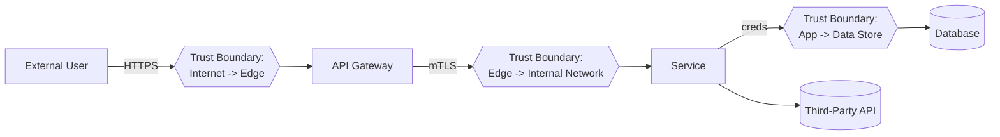
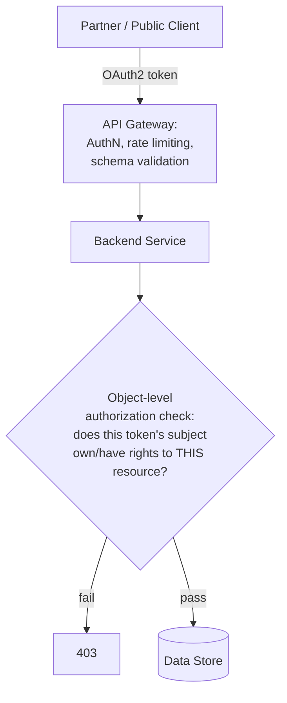

# Security Architect Scenario Based Interview Questions

**Scope note**: Scenarios 1–5 cover the infrastructure/cloud-architecture side of the role. Scenarios 6 onward are aimed squarely at the **Product/Application Security Architect** track — the person embedded with engineering who owns secure-by-design, threat modeling, API security architecture, and scaling security through champions rather than through infra controls alone. References grounding these: OWASP Application Security Verification Standard (ASVS) 5.0, OWASP Developer Guide, OWASP Code Review Guide, CISA's Secure by Design pledge, and general API security architecture practice.

## Table of Contents
1. [Scenario 1: Hybrid Cloud Migration](#scenario-1-hybrid-cloud-migration)
2. [Scenario 2: Vulnerability Response](#scenario-2-vulnerability-response)
3. [Scenario 3: Designing a Secure Application](#scenario-3-designing-a-secure-application)
4. [Scenario 4: Implementing Zero Trust Architecture](#scenario-4-implementing-zero-trust-architecture)
5. [Scenario 5: Securing a Remote Workforce](#scenario-5-securing-a-remote-workforce)
6. [Scenario 6: Standing Up a Threat Modeling Practice Across Engineering](#scenario-6-standing-up-a-threat-modeling-practice-across-engineering)
7. [Scenario 7: Building a Security Champions Program From Scratch](#scenario-7-building-a-security-champions-program-from-scratch)
8. [Scenario 8: Designing a Secure API Architecture for a Public-Facing Platform](#scenario-8-designing-a-secure-api-architecture-for-a-public-facing-platform)
9. [Scenario 9: Operationalizing Secure-by-Design Across the SDLC](#scenario-9-operationalizing-secure-by-design-across-the-sdlc)
10. [Scenario 10: Running a Security Architecture Review Board](#scenario-10-running-a-security-architecture-review-board)
11. [Scenario 11: Securing a Monolith-to-Microservices Migration](#scenario-11-securing-a-monolith-to-microservices-migration)

## Scenario 1: Hybrid Cloud Migration

**Question**: Your company is migrating critical services to a hybrid cloud environment. How would you ensure data security and compliance during this migration?

### Answer:

- **Risk Assessment**: Start with a comprehensive risk assessment to identify potential vulnerabilities in the current and new environments.
  - Tools: Use tools like NIST Cybersecurity Framework, and CIS Controls.
  - Output: Document potential risks and corresponding mitigations.

- **Data Encryption**: Implement encryption for data at rest and in transit.
  - Tools: Use encryption tools like AWS KMS, Azure Key Vault, or Google Cloud KMS.
  - Techniques: Apply AES-256 for data encryption and TLS 1.2/1.3 for data in transit.

- **Compliance**: Ensure adherence to relevant regulations (e.g., GDPR, HIPAA).
  - Steps: Regular audits, data classification, and applying specific security controls.
  - Documentation: Maintain an updated compliance matrix.

- **IAM Policies**: Establish robust Identity and Access Management policies.
  - Tools: AWS IAM, Azure AD, Google IAM.
  - Practices: Implement MFA, RBAC, and least privilege access.

- **Monitoring and Logging**: Implement continuous monitoring and logging.
  - Tools: AWS CloudTrail, Azure Monitor, Google Cloud Operations Suite.
  - Setup: Configure alerts for unusual activities and regularly review logs.

## Scenario 2: Vulnerability Response

**Question**: A new vulnerability has been discovered in a critical application used by your organization. As a Security Architect, how would you handle this situation?

### Answer:

- **Assessment and Prioritization**: Assess the severity and impact of the vulnerability.
  - Tools: CVSS scoring, vulnerability management tools like Qualys or Nessus.
  - Output: Determine the urgency based on business impact.

- **Coordination**: Coordinate with development and operations teams for patching.
  - Steps: Schedule patching during maintenance windows to minimize disruption.
  - Tools: Patch management tools like WSUS, SCCM.

- **Mitigation**: Apply temporary mitigations if immediate patching is not possible.
  - Techniques: Network segmentation, application firewalls, disabling vulnerable features.

- **Communication**: Inform stakeholders and provide updates on the remediation process.
  - Steps: Regular status meetings, email updates, incident tracking systems.

- **Post-Incident Review**: Conduct a post-incident review to identify gaps.
  - Tools: RCA (Root Cause Analysis) tools.
  - Output: Implement lessons learned and update security practices.

## Scenario 3: Designing a Secure Application

**Question**: You are tasked with designing a new web application with security as a priority. What steps would you take?

### Answer:

- **Security Requirements Gathering**: Identify and document security requirements.
  - Techniques: Threat modeling, stakeholder interviews.
  - Output: A comprehensive security requirements document.

- **Secure Development Practices**: Incorporate secure coding practices.
  - Techniques: OWASP Secure Coding Practices.
  - Tools: Static code analysis tools like SonarQube, Checkmarx.

- **Authentication and Authorization**: Implement strong authentication and authorization mechanisms.
  - Tools: OAuth 2.0, OpenID Connect, JWT for session management.
  - Practices: Enforce MFA, use RBAC.

- **Data Protection**: Ensure data is protected at rest and in transit.
  - Techniques: AES-256 encryption, TLS for data in transit.
  - Tools: Database encryption features, key management systems.

- **Regular Security Testing**: Conduct regular security testing throughout the development lifecycle.
  - Tools: SAST, DAST tools like OWASP ZAP, Burp Suite.
  - Practices: Continuous integration of security testing in CI/CD pipelines.

## Scenario 4: Implementing Zero Trust Architecture

**Question**: Your organization wants to move to a Zero Trust Architecture. How would you approach this transformation?

### Answer:

- **Assessment and Planning**: Conduct a current state assessment and plan the Zero Trust implementation.
  - Techniques: Gap analysis, defining clear goals and objectives.
  - Output: Zero Trust roadmap.

- **Identity and Access Management**: Strengthen IAM policies.
  - Tools: Identity providers like Okta, Azure AD.
  - Practices: Enforce MFA, context-aware access controls.

- **Network Segmentation**: Implement micro-segmentation to isolate resources.
  - Tools: SDN solutions like VMware NSX, Cisco ACI.
  - Practices: Define granular network policies.

- **Continuous Monitoring**: Establish continuous monitoring and analytics.
  - Tools: SIEM solutions like Splunk, ELK Stack.
  - Practices: Real-time monitoring, anomaly detection.

- **Least Privilege**: Apply the principle of least privilege across the organization.
  - Tools: PAM solutions like CyberArk, BeyondTrust.
  - Practices: Regularly review and adjust access permissions.

## Scenario 5: Securing a Remote Workforce

**Question**: With a significant portion of the workforce now remote, how would you ensure security and compliance?

### Answer:

- **Secure Remote Access**: Implement secure remote access solutions.
  - Tools: VPNs, Zero Trust Network Access (ZTNA) solutions like Zscaler, Perimeter 81.
  - Practices: Use split-tunneling, enforce MFA.

- **Endpoint Security**: Ensure all remote endpoints are secure.
  - Tools: EDR solutions like CrowdStrike, Carbon Black.
  - Practices: Regularly update and patch systems, use disk encryption.

- **Data Protection**: Protect sensitive data accessed remotely.
  - Tools: DLP solutions, encryption tools.
  - Practices: Enforce data classification, restrict data sharing.

- **User Awareness Training**: Conduct regular security awareness training.
  - Topics: Phishing, secure password practices, remote work security tips.
  - Tools: Training platforms like KnowBe4, SANS Security Awareness.

- **Monitoring and Compliance**: Continuously monitor and ensure compliance.
  - Tools: SIEM solutions, compliance management tools.
  - Practices: Regular audits, real-time monitoring of remote access logs.

---

## Scenario 6: Standing Up a Threat Modeling Practice Across Engineering

**Question**: Engineering ships fast and threat modeling currently happens (inconsistently) only when a security engineer has time to join a design review. As the Security Architect, how would you make threat modeling a repeatable, scalable practice across dozens of teams rather than a bottleneck on your own calendar?

### Answer:

- **Pick a methodology and keep it lightweight**: Standardize on **STRIDE** for component/data-flow-level threats (Spoofing, Tampering, Repudiation, Information Disclosure, Denial of Service, Elevation of Privilege) as the default, with **DREAD** or CVSS-based scoring only where teams need a quantified priority order — over-formalizing (mandatory full-blown DFDs for every one-line config change) is the single most common reason threat-modeling programs die from developer fatigue.
  - Output: A one-page "how to threat model in 30 minutes" guide teams can self-serve, not a 40-page process document nobody reads before a deadline.

- **Trigger on risk, not on calendar**: Define objective triggers for *when* a design needs a threat model — new trust boundary, new data classification touched, new third-party integration, new authentication/authorization pattern, significant architecture change — rather than "every project" (unsustainable) or "only when someone remembers" (what's happening today).
  - Output: A short intake checklist embedded in the design-doc template itself, so the trigger decision happens automatically as part of normal planning, not as a separate security gate someone has to remember to request.

- **Shift threat modeling left into the team, not just onto you**: Train engineers and security champions (see Scenario 7) to run their own first-pass threat model using a lightweight worksheet, with the security architect reviewing/coaching rather than authoring from scratch every time — this is what actually scales past the point where one architect's calendar is the bottleneck.
  - Tools: Threat-modeling aids like Microsoft's Threat Modeling Tool or OWASP Threat Dragon for teams that want a DFD canvas; a simple shared spreadsheet/template works fine for teams that don't.

- **Make the data-flow diagram the shared artifact, not the threat list**: Insist every threat model starts with a simple DFD showing trust boundaries — that single artifact is what turns "we think this is secure" into a structured conversation, because most missed threats come from an undocumented trust boundary, not from a clever attacker technique nobody could have predicted.

- **Close the loop with tracked findings, not a one-time document**: Every threat model output needs to land as tracked tickets with owners and due dates in the same backlog the team already uses (Jira, not a PDF that gets archived) — a threat model that doesn't produce enforced action items is a compliance exercise, not a security control.

- **Measure adoption, not just quality**: Track % of qualifying projects that got a threat model before launch, average time-to-remediate findings, and recurring threat categories across teams (a pattern like "everyone keeps missing SSRF on the outbound webhook feature" is itself an architecture-level signal — fix it with a shared library/pattern, not by re-explaining it in every review).

---

## Scenario 7: Building a Security Champions Program From Scratch

**Question**: Your security team is 5 people supporting 60 engineering teams. Leadership asks you to scale security influence without 10x-ing headcount. How do you design and launch a security champions program that actually works, rather than becoming a title with no substance?

### Answer:

- **Define the role concretely before recruiting anyone**: A champion is not "the person who does what the security team says" — they're an embedded engineer who spends a defined % of their time (commonly 10–20%) as the first line of security triage and context for their team: reviewing designs for obvious gaps, answering "is this safe" questions before they escalate, and being the conduit for security team guidance landing in a form their team will actually adopt.
  - Output: A one-page charter defining responsibilities, expected time commitment, and — critically — what a champion is explicitly *not* responsible for (they are not the team's incident responder or a substitute for a real security review on high-risk work).

- **Get manager buy-in on time allocation before launch**: The single most common reason champions programs fail is that the champion's manager never actually carved out the promised time, so the role becomes unpaid extra work the person quietly drops under deadline pressure — get the % time commitment written into the champion's actual goals/OKRs with their manager's sign-off, not just a verbal agreement with the champion themselves.

- **Make the incentive structure real**: Visibility (recognition from leadership, a defined career-development angle — many champions use it as a stepping stone toward a security role), access (a direct line to the security team, early access to new tooling/training), and light-but-real perks (dedicated training budget, a distinct badge/title recognized in performance reviews) — a program that's 100% obligation and 0% benefit has high turnover.

- **Structure recurring engagement, don't let it go dormant**: A regular (bi-weekly or monthly) champions sync covering new threats/techniques relevant to your stack, a recap of recent incidents/near-misses (sanitized, blameless) with the "why," and a forum for champions to raise friction points with existing security tooling/process directly to the team that owns it.

- **Give champions something concrete to do in their first 30 days**: A lightweight onboarding task list — run a threat model on their own team's next design doc with security-architect coaching, complete a foundational secure-coding training, do a walk-through of your SAST/SCA findings dashboard for their own service — so the role has early, tangible wins rather than an ambiguous "be more security-minded" mandate.

- **Measure program health, not just headcount of champions**: Track champion retention/turnover, the volume and quality of design reviews/threats caught at the champion level before escalating to the core team, and — the leading indicator that actually matters — whether the *core security team's* review queue depth is trending down as champion coverage matures, which is the actual ROI case leadership is asking you to prove.

---

## Scenario 8: Designing a Secure API Architecture for a Public-Facing Platform

**Question**: Your company is exposing a set of previously-internal-only APIs to third-party partners and, eventually, the public. As the security architect, how do you design the security architecture around this?

### Answer:

- **Start from an API inventory and classification, not from the gateway config**: You cannot secure what you don't know exists — build (or validate) a complete API inventory (including "shadow"/undocumented internal APIs that predate any governance) and classify each by data sensitivity and exposure tier (internal-only, partner, public) before designing controls, since the controls differ meaningfully by tier.
  - Tools: API discovery/inventory tooling integrated with your API gateway and service mesh; treat this the same way you'd treat an asset inventory for any other security domain.

- **Centralize authentication/authorization at the gateway, but don't stop there**: Enforce OAuth 2.0 / OpenID Connect at the API gateway for coarse-grained access control (who can call this API family at all), but implement **fine-grained, resource-level authorization inside each service** — the classic API security failure (OWASP API1: Broken Object Level Authorization) happens precisely because teams assume gateway-level auth is sufficient and skip the "does this specific caller have rights to *this specific* object" check inside the service itself.

- **Enforce a schema contract, not "trust the client"**: Require and validate an OpenAPI/JSON-Schema contract at the gateway for every endpoint (reject requests with unexpected fields, wrong types, oversized payloads) — this closes a large class of injection and mass-assignment issues before they ever reach application code, and it's a cheap, high-leverage control relative to trying to catch every case downstream.

- **Rate limit and quota by identity, not just by IP**: Public/partner APIs need per-client-identity quotas (not just a blanket IP-based rate limit) to prevent both abuse and the "denial of wallet" failure mode from resource-heavy endpoints, with tighter limits for unauthenticated/low-trust tiers and headroom for verified, contracted partners.

- **Version and deprecate deliberately**: Define an explicit API versioning and deprecation policy up front — a huge fraction of real-world API breaches happen through **old, undocumented, or "internal only" versions of an endpoint that were never actually decommissioned** (OWASP API9: Improper Inventory Management) after a newer, better-secured version shipped.

- **Log and monitor at the API layer specifically**: Standard infrastructure logging misses API-specific abuse patterns (excessive object enumeration, sequential ID scraping, unusual parameter combinations) — invest in API-aware monitoring/anomaly detection, not just generic WAF/network logs, and make sure logs capture enough context (caller identity, resource accessed, not just status code) to actually investigate an incident after the fact.

- **Contractually and technically bound third-party partners**: For partner-tier APIs, pair the technical controls above with a security addendum in the partnership agreement (data handling requirements, breach notification SLAs, right to audit) — a partner's security posture becomes your incident the moment their credentials are compromised, so the technical and contractual controls need to be designed together, not as separate legal vs. engineering workstreams.

---

## Scenario 9: Operationalizing Secure-by-Design Across the SDLC

**Question**: Leadership has publicly committed to CISA's Secure by Design principles. Your job is to turn that commitment into something engineering teams actually do differently day to day, not just a statement on a webpage. How do you approach it?

### Answer:

- **Translate the pledge into specific, measurable engineering commitments**: "Secure by Design" as a philosophy (security is a property designed in, not bolted on; the burden of security should shift from the customer/user to the manufacturer/vendor) needs to become concrete practices your teams can actually execute — e.g., committing to measurable reductions in specific vulnerability classes (memory-safety issues, default credentials, SQL injection) rather than a vague cultural aspiration.
  - Output: A short internal mapping document showing exactly which of your existing (or new) engineering practices satisfy each pledge commitment, so progress is auditable rather than aspirational.

- **Bake security requirements into the earliest design artifact, not into a later gate**: Security requirements (authN/authZ model, data classification, threat model trigger per Scenario 6) become a mandatory section of the design-doc template itself — the goal is that a design doc without a security section is structurally incomplete, the same way a design doc without a rollback plan would be considered incomplete, rather than security being a separate review that happens after the design is already "done."

- **Choose secure defaults and make the insecure path harder than the secure one**: This is the core of secure-by-design in practice — e.g., a new service template that ships with authentication enabled, TLS enforced, and least-privilege IAM roles pre-configured by default, so a team has to deliberately opt out of security rather than deliberately opt in. Paved-road internal platforms/libraries that handle auth, secrets access, and logging correctly out of the box do more for your security posture at scale than any amount of after-the-fact code review.

- **Reduce entire vulnerability classes structurally rather than fixing instances**: Favor memory-safe languages for new greenfield services where feasible, parameterized-query-only database access libraries (make raw string-concatenated SQL simply unavailable in your standard tooling), and centrally-managed cryptography (no team hand-rolls their own crypto or picks their own JWT library configuration) — per OWASP's Developer and Code Review guidance, structural elimination of a bug class scales far better than review-driven catch-and-fix of individual instances.

- **Integrate security tooling into the CI/CD pipeline as a quality gate, not an afterthought scan**: SAST, SCA/dependency scanning, and secret scanning run automatically on every PR with a defined, negotiated bar for what blocks a merge versus what's tracked as debt — the point of secure-by-design is that insecure code becomes *hard to ship*, not just *detectable after it ships*.

- **Report progress transparently, including where you're behind**: Publish (internally, and per the pledge's spirit, eventually externally where appropriate) a scorecard against the specific commitments you made — MFA adoption rate, CVE-class reduction trends, time-to-patch for critical vulnerabilities — because the credibility of a secure-by-design commitment rests on showing real, even imperfect, progress rather than a one-time announcement.

---

## Scenario 10: Running a Security Architecture Review Board

**Question**: New services and major architecture changes currently ship with no consistent security review — some get a thorough look, most get none, purely based on who happened to notice. How would you design and run a Security Architecture Review process that's rigorous but doesn't become the org's biggest bottleneck?

### Answer:

- **Right-size the review to the risk tier, not one-size-fits-all**: Define 2–3 review tiers based on objective criteria (new trust boundary, PII/regulated data, internet-facing, new third-party dependency with broad access) — low-risk changes get an async, self-service checklist; high-risk changes get a scheduled synchronous review with the architecture board; most changes should land in the lightweight tier, or the board becomes exactly the bottleneck you're trying to avoid.

- **Review the architecture, not the implementation**: The board's job is trust boundaries, data flow, authentication/authorization model, and blast radius of a compromise — not line-by-line code review (that's SAST/manual code review's job) and not re-litigating product decisions already made — scope creep into either direction is the fastest way to make the board slow and resented.

- **Require a lightweight, standard submission artifact**: A one-to-two-page design doc with a DFD (Scenario 6), explicit data classification, and a filled-in threat model summary is the entry ticket to a review slot — reviewing a vague verbal description wastes the board's time and produces weak findings; a standard template also lets less-senior reviewers meaningfully participate because the format is familiar.

- **Make the board's authority and escalation path explicit up front**: Decide and publish whether the board can actually block a launch, or only advise with an escalation path to a named executive for risk acceptance when a team disagrees — an architecture review with no teeth becomes theater, but one with unclear authority creates constant political friction; clarity here (decided once, not re-negotiated per review) is what makes the process durable.

- **Track findings and, more importantly, recurring findings as an architecture signal**: A single team missing rate limiting is a finding; **five different teams independently missing rate limiting** is a gap in your platform/paved-road, not five separate team failures — feed recurring patterns back into shared libraries, the service template (Scenario 9), and champion training (Scenario 7) rather than re-explaining the same fix in review after review.

- **Set and honor an SLA for the board itself**: Teams need a committed turnaround time (e.g., "high-risk reviews scheduled within 5 business days") — a review board that becomes an unpredictable multi-week wait will get bypassed by teams shipping around it, which defeats the entire purpose regardless of how good your review criteria are.

---

## Scenario 11: Securing a Monolith-to-Microservices Migration

**Question**: Your organization is breaking apart a large monolith into microservices over the next 18 months. As the security architect, what's your approach to making sure the security posture doesn't regress during the transition?

### Answer:

- **Recognize that the migration itself is a new, temporary attack surface**: The monolith's implicit trust (everything runs in one process, one deployment, one set of credentials) gets replaced by an explicit network of service-to-service calls — every one of those new calls is a new trust boundary that didn't exist before, and the transition period (part monolith, part services, calling each other) is often *less* secure than either the fully-monolithic starting point or the fully-decomposed end state, so plan security work as a first-class migration workstream, not a follow-up cleanup after the "real" migration is done.

- **Design service-to-service authentication before the first service is extracted**: Decide the pattern up front — mutual TLS via a service mesh (Istio/Linkerd), or signed service-identity tokens validated at each hop — rather than letting each extracted service invent its own ad hoc internal-trust assumption ("it's internal traffic, so no auth needed" is exactly the assumption that turns a single compromised service into full lateral movement across the whole new architecture).

- **Carry forward authorization logic deliberately, don't assume it "just moves"**: The monolith likely had authorization checks implicit in shared code paths and a single database's row-level access patterns; when a service is extracted, that authorization logic needs to be explicitly re-implemented and re-verified in the new service boundary — this is one of the most common places real vulnerabilities get introduced during decomposition, because the check was there in spirit but nobody explicitly ported it.

- **Decompose secrets and data access alongside the services, on the same timeline**: A monolith-wide database credential or shared secret becomes a serious over-privileged blast radius the moment it's inherited unchanged by a dozen new independent services — plan credential/secret decomposition (least-privilege, per-service credentials via a secrets manager) as part of each extraction, not as a "we'll get to it later" cleanup item that never happens once the extraction is declared done.

- **Threat model each extraction, scaled to its risk (tie back to Scenario 6)**: Not every service extraction needs a full board review (Scenario 10), but every one crossing a new trust boundary or touching sensitive data should get at least the lightweight threat-modeling pass — extractions are exactly the "new trust boundary" trigger condition that should route into your existing threat-modeling program rather than being treated as routine refactoring.

- **Keep the observability and incident-response story coherent through the transition**: A single monolith has one log stream and one obvious place to look during an incident; a partially-decomposed system has requests crossing many services, and if distributed tracing/correlated logging isn't in place from early in the migration, your ability to investigate an incident (or even notice one) degrades significantly right when the attack surface is at its most complex — instrument this early, not as an afterthought once services are already in production.

- **Set an explicit security exit criterion for "done"**: Define what "the migration is secure" means concretely (service-to-service auth in place org-wide, no service running with monolith-era broad credentials, no unauthenticated internal endpoints) and track it as a real, reported metric alongside the functional migration milestones — an 18-month migration with no security checkpoint until the very end guarantees you find the gaps at the worst possible time.
